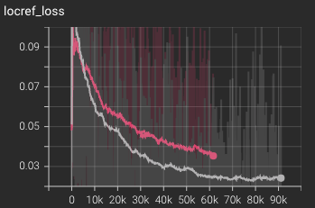
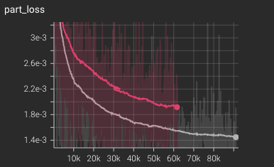
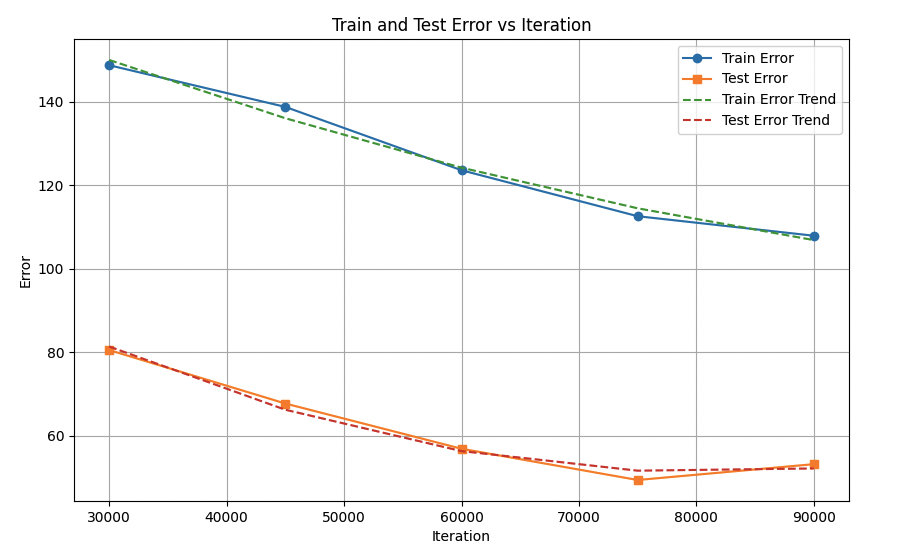
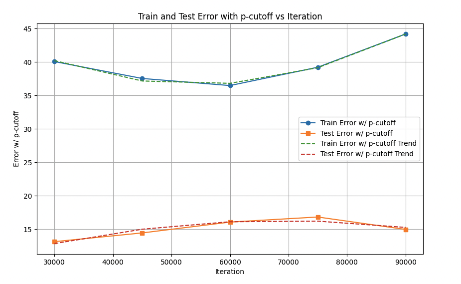

<h2 align='center'>📜 The Tale of Transferring Superquad's Legacy: A DeepLabCut Odyssey 🐁</h3>
<h4 align='center'>🌌 "If I have seen further it is by standing on the shoulders of Giants." 🌌</h4>


### 🌟 Motivation: Use transfer learning!! 📚

- In the ever-evolving landscape of deep learning, one recurring theme stands out: the practice of building upon prior knowledge. This echoes the broader symbolism inherent in scientific endeavors, where each new discovery is a layer added upon the bedrock of established models.

### 🔥 **Prologue: The Legend of SuperAnimal-Quadruped** 
- 👏 First of all a hearty round of applause for the creators of SuperAnimal_Quadruped. This model, trained on over 40,000 images spanning diverse quadrupeds—from the humble mouse to the majestic elephant—serves as an indispensable asset for those aiming to leapfrog the initial stages of model training! This model has 39 keypoints AKA bodyparts it can predict. 👀


### 🎯 **Objective**
- Leverage `transfer learning` to enhance the performance of Model C by harnessing the deep knowledge embedded in the lower layers of a pre-trained model A (SuperAnimal-Quadruped). We will construct a novel Model B using `TensorFlow 1.X` methods to inherit base layers from Model A and integrate the prediction layer from Model C to ensure proper allignment. 

### 🎗️**Feature Hierarchy in Neural Networks:** 
- Neural networks, especially deep convolutional networks, tend to learn features in a hierarchical manner. Initial layers often capture basic structures and patterns such as edges, textures, and colors. As we move deeper into the network, layers tend to recognize more complex structures. When we discuss the "base layers", we're often talking about these foundational patterns and structures. By transferring these base layers, we essentially equip the new model with a matured understanding of these fundamental features:
###
- **Edge Detection**
- **Texture Recognition**
    - Recognizing patterns and combinations of edges
- **Color Discrimination**
    - Discern regions of varying color
- **Pattern Detection** (stripes, splots, swirles)
- **Scale Invariance**
    - Designed to recognize patterns and features regardless of their size in the image -> more robust to varying sizes 🦾   
- **Spatial Hierarchies**
    - Which body parts are usually seen together
- **Robustness to partial occlusion**
    - Receptive Field ⬆️
    - Pooling layers

### 🚀 **Benefits of Transfer Learning**
- While there are many benefits to harnessing the power of a pre-trained model, here are some particular benefits worth noting: 
    - Faster Convergence
    - Less Data Required
    - Improved Performance
    - Lower compute costs
    - Better Generalization 
    - Mitigate overfitting 
    - Extensibility
### **The Mystical Land of DeepLabCut** ✨
- Introducing [DeepLabCut](https://github.com/DeepLabCut/DeepLabCut) 🐁 an open-source toolbox that leverages machine learning techniques to estimate the poses of animals (and humans) in images and videos. DeepLabCut is an open-source toolbox designed to harness machine learning techniques for estimating the poses of animals (and humans) in images and videos. Originally gaining traction in the neuroscience and ethology sectors for meticulous behavioral analysis, its foundational principles make it adaptable for a myriad of applications beyond its initial scope.

- Harnessing the robust capabilities of DeepLabCut, we'll leverage pythons class inheritance to craft a variation of the PoseResnet() class that holds the power of our pre-trained model without it's specialized knowledge. This will aid in a seamless and error-free weight transfer. 🛠️🚀 If this piques your interest, dive deeper with us in the following sections! 📖👀

### **TensorFlow - The Guardian of Pose Estimation** 🛡️
- 🔮 TensorFlow, the formidable open-source machine learning framework birthed by Google Brain. TensorFlow equips its users with a comprehensive platform for crafting, refining, and deploying large-scale machine learning models. As the AI landscape evolves, so does the software; hence our choice to employ the compat version of TensorFlow. This decision ensures we bridge the past and present, enabling us to harmonize with legacy models, especially during intricate weight transfers.

### **Preparing for the Quest** 🌄
#### 🪐 Embarking on this journey requires comprehension of the underpinnings and mechanisms at play. Here's a roadmap to help keep us aligned:
- Model A : SuperAnimal-Quadruped (other pre-trained model) 
- Model B : A new model we create to transfer the weights to and save a snapshot of. 
- Model C : The new model we want to train using the deep knowledge of SuperAnimal-Quadruped. 
  - Knowledge prerequisites (e.g., basic Python, TensorFlow, deep learning concepts).
- 🔮 Setting up the environment.
- Environments will vary for everyone however keep in mind executing the computational graph (when we actually transfer the weights) can be GPU memory intensive. 
- This cookbook assumes the following:
    - **A pose_cfg.yaml file** generated for your Model C in your /dlc-models/iteration0/shuffle1/ this would have happedned when you ran `deeplabcut.create_dataset()`
    - **Resnet_50 Architecture** - Our pre-trained model (SuperAnimal-Quadruped) uses the Resnet_50 architecture, this means Model B and Model C must also have the Resnet_50 architecture. While there may be workarounds its not possible to directly transfer weights from one architecture to another due to mismatch in tensor shapes and architecture differences (depth, width activation functions, channel-wise recalibration before GAP, etc...).
    - **Access** to the DeepLabCut code base.

### **The Journey Begins** 🌀
- 📚 Lets get the necessary imports
```python
# Standard library imports
# Standard library imports
import sys
import yaml

# Third-party imports
import tensorflow.compat.v1 as tf
from tensorflow.compat.v1 import keras
import tf_slim as slim

# Module-specific imports
from deeplabcut.pose_estimation_tensorflow.nnets.resnet import PoseResnet

# Setup commands
tf.reset_default_graph()
sys.path.append('/home/ec2-user/miniconda3/envs/dlc/lib/python3.8/site-packages/deeplabcut/pose_estimation_tensorflow/nnets/')
tf.disable_v2_behavior()

# Module-specific imports
from deeplabcut.pose_estimation_tensorflow.nnets.resnet import PoseResnet
```
- 🔎 A few words about `TensorFlow` scope: TensorFlow 2.x made significant changes to its core design. One of the most notable changes was the removal of the static computational graph approach in favor of the more intuitive and pythonic approach of eager execution. As a result, several constructs from TensorFlow 1.x were either deprecated or radically changed, including **variable scopes**. 

- I chose TensorFlow's compat mode to seamlessly integrate with existing TensorFlow 1.x codebases and to accommodate readers still using this version, ensuring the cookbook's accessibility and utility for a wider audience.

 
- In TensorFlow naming is crucial. Each `variable` must have a unique identifier here are some examples of typical variable names in a Resnet_50 Model instantiated within the model_a scope. Notice the prefix of /model_a/ indicating the scope. In TensorFlow the scope shows up as a prefix to the variable name this will become important when we transfer weights:
```
/model_a/resnet_50/conv1/weights
/model_a/resnet_50/block1/unit_1/bottleneck_v1/shortcut/weights
/model_a/resnet_50/block1/unit_1/bottleneck_v1/conv1/BatchNorm/moving_mean
/model_a/resnet_50/block2/unit_2/bottleneck_v1/conv2/BatchNorm/moving_variance
/model_a/resnet_50/block3/unit_3/bottleneck_v1/conv3/BatchNorm/beta
```
- These varibles are typically used to store model parameters learned from training. (weight matrices, bias vectors etc...) The values of these varaibles is what we aim to transfer.
### **Starting our first tensorflow session**  ⛏️
  ```python
sess = tf.Session()
# Start a TensorFlow Session
with tf.variable_scope('model_a'):
    snapshot_path = '/path/to/snapshot-700000'
    # Load the graph structure into current TensorFlow session
    saver = tf.train.import_meta_graph(snapshot_path + '.meta')
    saver.restore(sess, snapshot_path)

    exclude = ['adam', 'block4', 'global_step:0', 'beta1_power:0', 'beta2_power:0']
    base_layers = [var for var in tf.global_variables() if not any(keyword in var.name.lower() for keyword in exclude)]

    base_weights_values = sess.run(base_layers)
```
#### `with tf.variable_scope('model_a'):`
- This line ensures that variables created in the context of this block will have their names prefixed with 'model_a/'. This helps in organizing our variables and avoiding clashes when working with multiple modles. (TF will automatically append a '_0' or '_1' to the variable name for different models loaded into the same graph if no scopes are used. However it't not good practice to rely on this.)
#### `exclude = ['keyword_1',  'keyword_2', 'keyword_3',....keyword_N]`

-  This line creates a list of keywords used to filter for the base layers. Depending on the depth of the network and the specific layers you are interested in you can edit the exclude list accordingly. 


#### `tf.global_variables()`
- A function used to retrieve a list of all global variables within the current computational graph - pay attention to *global* here, this will contain all the variables for any model loaded in the graph. This will become important later. Use the below code to inspect the variable names and decicde which layers you want to keep.  
```python
    all_variables = tf.global_variables()
    for v in all_variables:
        print(v.name)
```
- Typically there will be a `block#` value in the name like: 
```python
/model_a/resnet_50/block1/unit_1/bottleneck_v1/conv1/BatchNorm/moving_mean
```
- Above its `block1` - the higher the number the higher the layer in the network, so in my particular case `block4` was the highest block thus I filtered it out. You will have to print our your layers and inspect which ones you want to filter out.
- Also generally I don't want to transfer any optimizer information so I filter out all the varibles containing `adam`
#### `base_weights = sess.run(base_layers)`
- Finally we use a list comprehension to select the particular variables we are intrested in and use sess.run to execute the computational graph retrieving the values of the variables.

### **Get the config files** 📖
```python
path_to_pretrained_pose_cfg = '/path/to/model_b/pose_cfg.yaml'
with open(path_to_pretrained_pose_cfg, 'r') as file:
    cfg_A = yaml.load(file, Loader=yaml.FullLoader)
    
path_to_model_c_pose_cfg = '/path/to/model_c/pose_cfg.yaml'
with open(path_to_model_c_pose_cfg, 'r') as cfg_file:
    cfg_C = yaml.load(cfg_file, Loader=yaml.FullLoader)
```
- Remember we want to build our new model B with the base layers of model A and the top layer of model C. This is why we need both config files.

### **Power of Python Inheritance** 🕸️ 
```python
from deeplabcut.pose_estimation_tensorflow.nnets.resnet import PoseResnet
sys.path.append('/home/ec2-user/miniconda3/envs/dlc/lib/python3.8/site-packages/deeplabcut/pose_estimation_tensorflow/nnets/')
```
- It's important to make sure the above module specific import and set up command are executed to ensure access to DeepLabCut code. 
```python
class ModifiedPoseResnet(PoseResnet):
    def __init__(self, cfg_A, cfg_C):
        # Call the original initalizer
        super(ModifiedPoseResnet, self).__init__(cfg_A)
        # Store model C's configuration
        self.cfg_C = cfg_C

    def prediction_layers(self, features, end_points, scope='pose', reuse=None):
        # Use the stored configuration 
        num_channels = self.model_c_cfg['num_joints'] * 2 # assuming x, y for each joint
        num_channels += self.model_c_cfg.get('num_idchannel', 0) # additional channels if any

        # Defining the prediction layers 
        with tf.variable_scope(scope, reuse=reuse):
            # Create a 2D convolutional layer
            pred = slim.conv2d(features, num_channels, [1, 1], scope='final_pred')

        return pred
 ```

#### **Allignment with Model C:** 

- It's critical to make sure the archetecture of the models align, especially when it comes to the number of output units in the final layer.

- We use `super` to pass the pose_cfg.yaml for Model A (our pre-trained model) to the parent class PoseResnet. This is what builds the base layers of model B in a way that will align with those of Model A setting us up for the transfer to take place. 

- While one could use the Keras API with TensorFlow 2.x I opted to use the TensorFlow 1.x method for aforementioned reasons. 


### **Build Model B 🏰**
- Let's set our `scope = model_b` so we can keep the variables for differnt models organized. 
```python
with tf.variable_scope('model_b'):
    model_b = ModifiedPoseResnet(cfg_A, cfg_C)
    dummy_input = tf.random.uniform([1, 224, 224, 3])
    _ = model_b.get_net(dummy_input)
```
- Model B is bult by passing cfg_a (pose_cfg.yaml of our pre-trained model) and cfg_c (pose_cfg.yaml of our model C) to build the bottom and top layers respectively. 

- We initalize and define the computational graph for Model B with `dummy_input` with batch size one, `224x224` pixels and `3` channels for RGB
### **The Transfer** 🔗
- 🪔 First lets filter the global variables by scope: 
```python
model_a_vars = [v for v in tf.global_variables() if v.name.startswith('model_a/')]
model_b_vars = [v for v in tf.global_variables() if v.name.startswith('model_b/')]
``` 
- Initialize  all of the variables in the computational graph
- Identify the matching varaibles
- Assign the value of each base layer variable in Model A to the corresponding varaible in Model B. This is why we took such care to make sure they algin. If there is a mismatch we will get an error. 
```python
with tf.Session() as sess:
    # Initialize variables
    sess.run(tf.global_variables_initializer())
    
    for var, value in zip(base_layers, base_weights_values):
        # Construct the corresponding stripped variable name
        stripped_name = var.name.split('model_a/')[1].split(':', 1)[0]
        
        # Find the corresponding variable in Model B
        matching_vars = [v for v in model_b_vars if v.name.split('model_b/')[1].split(':', 1)[0] == stripped_name]
        
        if not matching_vars:
            print(f"Could not find variable in Model B corresponding to {stripped_name}")
            continue
        
        # We assume there's only one matching variable, so we take the first
        var_in_B = matching_vars[0]

        # Assign the value
        assign_op = var_in_B.assign(value)
        sess.run(assign_op)
    
    # Save the variables without the 'model_b/' prefix
    # Construct a dictionary mapping from variable name without prefix to variable
    var_name_to_var = {var.name.split('model_b/')[1].split(':')[0]: var for var in model_b_vars}
    saver = tf.train.Saver(var_list=var_name_to_var)
    save_path = '/path/to/destination/model_b_snapshot'
    saver.save(sess, save_path)
```
- Finally use TF 1.X `saver` to save or new Model B to file. Its imporant to strip the scope from the name otherwise you will get an error when training Model C - it will look for traditional variable names without the prefixed scope. 
- Thats it! You should now have a snapshot of the new Model B saved at `save_path` which you can now use as the init_weight vale of the pose_cfg.yaml file of your very own Model C 

### **Validating the Legacy** 🌱
-  Below is a testiment to how beneficial transfer learning of this type can be. The `grey line` is my model C using the Super-AnimalQuadruped base layers and initital weights, the `red line` is training model C from the ImageNet weights **without** the transfer learning. 


<p align="center">
  
  
</p>

### Below are the plots of test/train with and without p-cutoff for Model C using SuperAnimal-Quadruped as the initial weights. 
<p align="center">
  
  
</p>


### **Appendices: Additional Resources & Scrolls** 📚
- 🔗 Have fun with deeplabcut here:
https://github.com/DeepLabCut/DeepLabCut
- 📝You can find the weights here: 
 https://huggingface.co/mwmathis/DeepLabCutModelZoo-SuperAnimal-Quadruped
